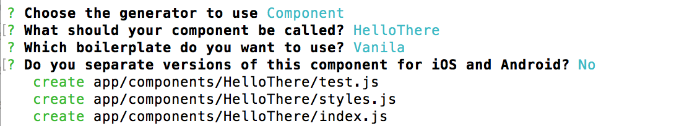
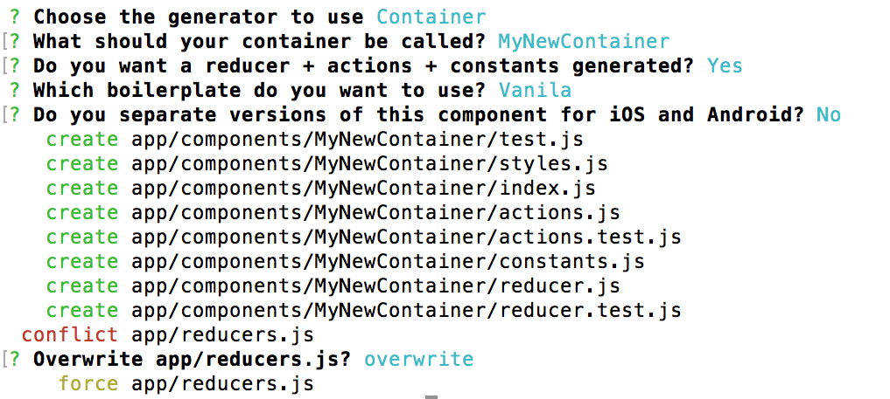

# 🍰 Baker - Delicious React Native Apps 

Baker helps you kickstart your React Native app development and helps you type less and do more 

## Quickstart

You must have your system ready for React Native. This generally means going through [Getting started section](https://facebook.github.io/react-native/docs/getting-started.html#content) section of RN's website.

```sh
git clone https://github.com/thebakeryio/baker.git MyReactNativeApp
cd MyReactNativeApp && npm install && npm run setup 
```

Running your app on iOS

```sh
npm run ios
```

Running your app on Android

```sh
npm run android
```

Scaffolding

```sh
npm run generate
```

## What is included?

- basic RN app that you get with ```react-native init AwesomeProject```, no funny business
- predictive state management using [Redux](http://redux.js.org/)
- performant selectors using [Reselect](https://github.com/reactjs/reselect) and [Immutable.js](https://facebook.github.io/immutable-js/)
- scaffolding for your components - so you type less and get more  
- some useful [component boilerplates](https://github.com/thebakeryio/generator-rn/tree/master/src/generators/component/templates/boilerplates) (e.g. Tab based navigation, Card based navigation)

## What will my app look like?

Take a look at [TodoMVC React Native example](https://github.com/thebakeryio/todomvc-react-native) to see what a typical baker based app looks like 

## Scaffolding 

Baker uses a Yeoman based [React Native generator](https://github.com/thebakeryio/generator-rn)

### Terminology: Components VS Containers

Baker lets you generate both components and containers. The difference between a component and a container is that components do not have direct acccess to the app data - all the data components get comes from their parent Containers (using props). Containers connect to application state using [connect function](https://github.com/reactjs/react-redux/blob/master/docs/api.md#connectmapstatetoprops-mapdispatchtoprops-mergeprops-options) from React Redux.

**Note:** We do NOT separate components and containers into different subdirectories (both components and containers reside within /components directory) for the following reason: a given component can turn into a container and vice versa multiple times during app development process as you are figuing out the best way to organize your component hierarchies. Having a single directory for containers and pure components allows you to skip a lot of tedious chores migrating import paths when you find yourself change your mind again.

### Using scaffolding 

```sh npm run generate``` will activate RN generator and give you a list of available generator options. From there you should be able to follow along and get things tailored for your specific needs.

### Generating components

Picking 'Component' option from the initial generator screen will take you to the Component generator submenu



Component generator has the following options:

- **component name**: this is what your component is going to be called
- **boilerplate**: you can ask Baker to include some standard code for typical components (Vanila is a default component boilerplate with a bare minimum of setup)
- **plaform specific code**: Baker can generate *.ios* and *.android* versions of your component in case you need to treat certain (or all) aspects of you component differently on different platforms (the default is a single version of the component for both platforms)

### Generating Containers



Container generator is built upon a component generator and includes all of it's options above in addition to the following option:

- **creating a reducer**: you can choose to create a reducer + actions + constants modules to associate with your container (defaults to true)

## Sample apps built using Baker

- [TodoMVC](https://github.com/thebakeryio/todomvc-react-native)
